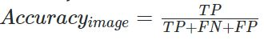

# WheatDetection
DL case 3  
# Introduction  
This programm system contains models which learned by 'TenserFlow'.  
The system allows you to test hypotheses on photos of wheat.  
For example, you can check the availability of harvest and evaluate the quality of work.  
# How to run  

`conda create -n wheatenv python=3.6`

`conda activate wheatenv` 

` pip3 install -r requirements.txt`

# Demo  
On img you could see prediction on wheat 'head'  

# Metrics - Average Domain Accuracy

Accuracy for one image:

where:

* TP is true Positive is a ground truth box matched with one predicted box
* FP a False Positive (FP) a prediction box that matches no ground truth box
* FN a False Negative (FN) a ground truth box that matches no box.

### Matching method

Two boxes are matched if their Intersection over Union (IoU) is higher than a threshold of 0.5 .

### Average Domain Accuracy

The accuracy of all images from one domain is averaged to give the domain accuracy.

The final score, called Average Domain Accuracy, is the average of all domain accuracies.

### Our result
Accuracy result is 0.461

# Experiments
In the experiment, various architectures of neural networks from the ResNet family were tested.
they are ResNet18, Resnet50 and ResNet101. Resnet 18 showed a much worse result than resnet50, and although
ResNet101 showed a slightly better result, its training time was almost 2.5 times longer than that of ResNet50.

# Сhoosing the best model

The selection of hyper parameters was carried out inside the config,
which was used to train the model. 
Were selected:
* batch size, 
* parameters for
image augmentation
* speed and time (number of epochs) of training

# Experiments setup

Hardware

CPU count: 1 Ryzen 4600H
All experiments were performed on a Ryzen 4600H CPU. 
For a faster recognition process, it is recommended to use the GPU

It takes about 7-9 seconds to process 10 images

For industrial use and scalability, running the program on the GPU is required.
A scaling option is possible in the form of tracking the harvest on a video stream in real time
